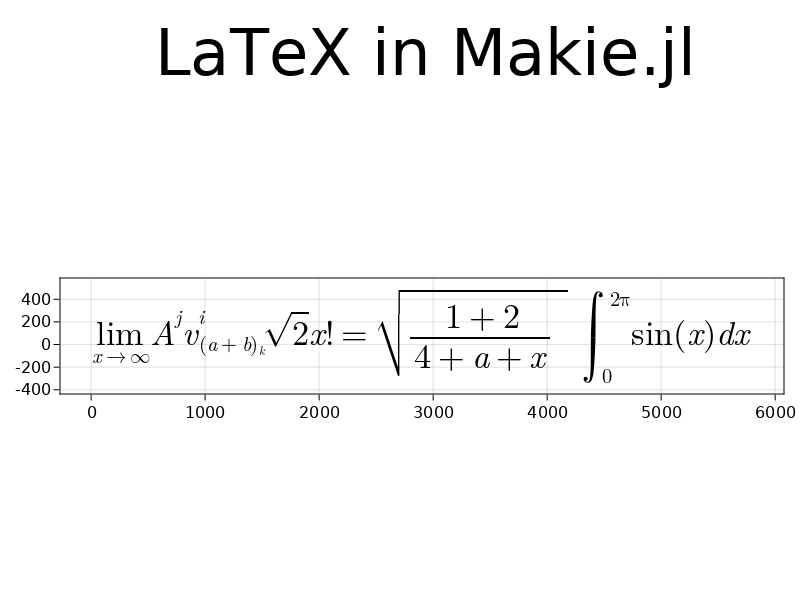

# MathTeXEngine

This is a work in progress package aimed at providing a pure Julia engine for LaTeX math mode. It is composed of two main parts: a LaTeX parser and a LaTeX engine, both only for LaTeX math mode.

## Engine

Them main use of the package is through `generate_tex_elements` taking a LaTeX string as input and return a list of tuples `(TeXElement, position, scale)` where `TeXElement` is one of the following:

- `TeXChar(char, font)` a unicode character to be displayed in a specific font.
- `VLine(height, thickness)` a vertical line.
- `HLine(width, thickness)` an horizontal line.

This contains enough information to then draw everything with any plotting package that can draw arbitrary glyph in arbitrary font. The position is the origin of the character according to `FreeType`.

The engine should support every construction the parser does (see below).

Currently the only font set supported is New Computer Modern.

### Example



## Parser

Parsing is done through the exported function `texparse` into nested `TeXExpr` objects forming a tree. The parser does not perform any layouting.

### General features
- Parsing of LaTeX expression into nested `TeXExpr` objects consisting of a head (e.g. `:frac`) representing the type of the expression and a list of arguments.
- Mapping of LaTeX command to the corresponding Unicode symbols.
- Unicode character input, parsed as they respective command.
- Pretty printing of the the resulting expressions.
- Hopefully helpful error messages.
- `texexpr(expr, showdebug=true)` showing each parsing step.

### Supported constructions
- `:decorated [core, subscript, superscript]` Elements "decorated" with subscript and superscript.
- `:delimited [left_delimiter, content, right_delimiter]` Groups with automatically sized delimiters.
- `:frac [numerator, denumerator]` Fraction.
- `:function [name]` Named functions (like `sin`).
- `:group [elements...]` Groups defined with braces, possibly nested.
- `:integral [symbol, low_bound, high_bound]` Integrals.
- `:spaced [symbol]` Symbols with spaces around them (binary symbols, relational symbols and arrows).
- `:symbol [char, command]` Generic recognized symbol. `char` is the unicode `Char` representing the symbol and `command` is a string containing the command input in LaTeX.
- `:underover [symbol, under, over]` Symbols or function with information over and/or under them (sum, limits and the like, except integrals that have a separate object).

### To be implemented
- `:accent [symbol, core]` and `:wide_accent [symbol, core]` Narrow and wide accents.
- `:mathfont [fontstyle, content]` Mathematical font commands (`\mathbb` and the like). `fontstyle` omits the starting `\math` (e.g. it is `bb` for a `\mathbb` command).
- `:punctuation [symbol]` Punctuation (I don't think they are treated differently from other symbols in math mode though).
- `:space, [width]` Fixed space commands (the `\quad` family).


### Example

```julia
julia> texparse(raw"\sum^{a_2}_{b + 2} \left[ x + y \right] \Rightarrow \sin^2 ω_k")
TeXExpr :expr
├─ TeXExpr :underover   
│  ├─ TeXExpr :symbol   
│  │  ├─ '∑'
│  │  └─ "\\sum"        
│  ├─ TeXExpr :group    
│  │  ├─ 'b'
│  │  ├─ TeXExpr :spaced
│  │  │  └─ TeXExpr :symbol
│  │  │     ├─ '+'
│  │  │     └─ "+"
│  │  └─ '2'
│  └─ TeXExpr :decorated   
│     ├─ 'a'
│     ├─ '2'
│     └─ nothing
├─ TeXExpr :delimited      
│  ├─ 'x'
│  ├─ TeXExpr :spaced
│  │  └─ TeXExpr :symbol
│  │     ├─ '+'
│  │     └─ "+"
│  ├─ 'y'
│  └─ TeXExpr :right_delimiter
│     └─ ']'
├─ TeXExpr :spaced
│  └─ TeXExpr :symbol
│     ├─ '⇒'
│     └─ "\\Rightarrow"
├─ TeXExpr :decorated
│  ├─ TeXExpr :function
│  │  └─ "sin"
│  ├─ nothing
│  └─ '2'
└─ TeXExpr :decorated
   ├─ TeXExpr :symbol
   │  ├─ 'ω'
   │  └─ "\\omega"
   ├─ 'k'
   └─ nothing
```